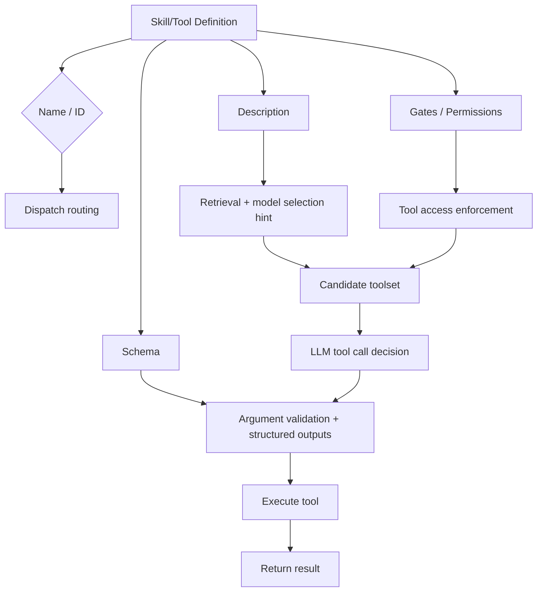

# LLM Skill Formats: Structure, Routing, and Tool Gating

## Executive Summary

Across modern agent runtimes (Claude Code, MCP, LangChain, CrewAI, AutoGen), the structural elements that most consistently improve **capability routing**, **tool gating reliability**, and **execution accuracy** are those that are **machine-parseable** and **actionable by the host runtime** rather than merely "helpful prompt formatting." Every framework converges on a **Triplet Pattern**: **(identifier/name, behavioural description, input schema + gating controls)**. Names and schemas are reliably parsed and dispatchable; descriptions are primarily consumed as retrieval/routing features and are *usually non-enforceable hints* (unless the runtime uses them for search/ranking). citeturn6view0turn18view0turn14view1turn16view0turn15view2turn11view0

**Core thesis**: Less tool context produces more accuracy and performance. Tool gating via selective loading consistently improves outcomes — Anthropic's Tool Search lifted MCP eval accuracy from 49% to 74% (Opus 4) and 79.5% to 88.1% (Opus 4.5) while materially shrinking token overhead. citeturn24view0 Independent research shows up to 70% execution time reduction from dynamic tool narrowing. citeturn26view1

Token waste is dominated less by YAML/JSON parsing overhead and more by **context bloat** from tool definitions and tool outputs. Anthropic reports real deployments where tool definitions consumed **55K+ tokens** (58 tools) and even **134K tokens** pre-optimisation. citeturn24view0 Claude Code explicitly mitigates this with **MCP Tool Search**, automatically deferring tool loading when tool descriptions exceed **10% of the context window**. citeturn5view2 LangChain's Deep Agents similarly offloads tool outputs > **20,000 tokens** to the filesystem. citeturn25view0

Where strict empirical data is missing for a given framework, the evidence base is strongest in: (a) **tool retrieval benchmarks** (showing retrieval quality directly impacts end-to-end pass rates — and even strong IR models can perform poorly on tool retrieval tasks), and (b) **long-context studies** showing performance degradation with large contexts ("Lost in the Middle"), which supports aggressive context minimisation and selective loading. citeturn27view1turn19search1

**Concise best practices**:
- Treat **name + schema** as the enforceable core; treat **description** as a retrievable hint that must be **disambiguating** and **index-friendly** (keywords + domain nouns + constraints). citeturn14view1turn24view0turn18view0
- Implement **runtime tool gating** as a first-class mechanism (allowlists/denylists, per-task tool lists, bind-tools subsets), and validate tool calls against schema; do not rely on prompt-only instructions to prevent misuse. citeturn5view0turn15view2turn16view0turn23view1
- For large tool libraries, use **retrieval-driven tool routing** (BM25 + embeddings hybrid is common in production search engines and supported in multiple tool-search stacks). citeturn24view0turn20search0turn20search1turn20search2

**Assumptions**: Where runtimes do not specify details, the routing system is evaluated on a typical cloud agent runtime (x86 Linux), tool description fields are indexed in both lexical and semantic retrieval layers, and schema validation is performed by a standard JSON Schema validator (Ajv/fastjsonschema/jsonschema equivalents) rather than bespoke parsing.

---

## Finding 1: Claude Code Skills Discovery

YAML frontmatter (`name`, `description`, `allowed-tools`) is THE discovery mechanism for Claude Code skills. The runtime parses these fields to determine:
- Whether the model can auto-invoke the skill (`disable-model-invocation`)
- Which tools are available without approval when the skill is active (`allowed-tools`)
- How the skill surfaces during search (hybrid retrieval: BM25 over name/description, embeddings over body)

Skills are auto-discovered from `SKILL.md` files; permissions are managed via `/permissions` and settings; MCP server allow/deny policies are controlled via `allowedMcpServers` / `deniedMcpServers`. citeturn4view0turn22view0turn5view0

**Practical constraint**: Keep k small (1–3 skills injected) to avoid prompt bloat. Claude Code's MCP Tool Search activates when tool descriptions exceed 10% of the context window, forcing selective loading. citeturn5view2

### What is actually parsed and enforceable

A reliable way to distinguish "structure that helps" from "structure that routes" is to ask: **Does the runtime parse it into typed fields and change behaviour if it is wrong/missing?** If yes, it is runtime-consumed.

| Field | Runtime consumption | Enforceable? |
|---|---|---|
| `name` | Dispatch routing, search index | Yes — unknown names produce protocol errors. citeturn23view1turn14view2 |
| `description` | Retrieval ranking, model hint | No — MCP spec frames this as a "hint" to improve model understanding. citeturn14view1turn23view2 |
| `allowed-tools` | Permission gating (deny → ask → allow) | Yes — deny rules take precedence; wildcarded specifiers can constrain Bash/WebFetch/MCP tools. citeturn22view0turn18view0 |
| `input_schema` / `inputSchema` | Argument validation | Yes — `strict: true` guarantees conformance ("no more type mismatches or missing fields"). citeturn6view0 |
| `disable-model-invocation` | Auto-invocation control | Yes — parsed at skill load. citeturn18view0turn18view2 |
| `context` | Skill context injection | Yes — parsed by runtime. citeturn18view0turn18view2 |

Claude API tool use similarly has runtime-consumed structure in `tools[]` objects (`name`, `description`, `input_schema`). Adding `strict: true` guarantees schema conformance for tool inputs. Note: MCP tool conversion requires renaming `inputSchema` → `input_schema` for Claude API interop. citeturn6view0turn6view1turn6view2

### Three forms of structure compared

YAML frontmatter, JSON Schema, and tool registration APIs serve different architectural roles:

- **YAML frontmatter** = **configuration carrier** — enforceability depends on the runtime's parser and rules
- **JSON Schema** = **contract** — for arguments and/or outputs
- **Tool registration APIs** = **in-memory registries + dispatch wiring** — with schema inference and provider-format conversion

| Structure form | Typical runtime-consumed fields | What can be enforced | Primary failure mode prevented | Notes on overhead |
|---|---|---|---|---|
| YAML frontmatter (e.g., Claude Code skills) | `name`, `description`, `disable-model-invocation`, `allowed-tools`, `context`, etc. citeturn18view0turn18view2 | Invocation control + tool access control (via permissions integration) citeturn18view2turn22view0 | Unwanted auto-invocation; over-permissioned tool use | Parse cost depends on runtime; often parsed at startup or on file change rather than per request |
| JSON Schema (tools) | `inputSchema`/`input_schema`, `outputSchema` | Argument shape/type validation; error typing; sometimes guaranteed conformance (strict modes) citeturn6view0turn14view1turn23view2 | Malformed arguments; brittle string-parsing; schema drift | Validator compilation and validation cost can be non-trivial but usually far below LLM inference |
| Tool registration APIs | `name`, `description`, schema from annotations/types; binding lists | Tool list gating; dispatch by name; orchestration loops citeturn16view0turn11view1turn15view2 | Hallucinated/unregistered tools; mismatch between "callable" and "executable" wiring | Avoids repeated parsing of definitions; conversion to provider formats still required |

---

## Finding 2: What Actually Matters for LLM Comprehension

Structure consumed **programmatically** provides the largest gains. YAML headers alone, without runtime consumption, offer minimal benefit beyond human readability.

**Evidence hierarchy** (strongest to weakest impact):
1. **Schema-enforced tool gating** — JSON Schema enforcement reduces invalid outputs by an order of magnitude vs prose instructions. Claude's `strict: true` eliminates type mismatches and missing fields entirely. citeturn6view0
2. **Few-shot exemplars + compact structure** — outperforms schema-only prompts. 1–2 canonical examples plus 1 anti-example is the sweet spot.
3. **Token budget discipline** — 300–700 tokens per skill body is optimal. Over-structured prompts that bloat tokens IMPAIR performance (the "Lost in the Middle" effect degrades retrieval when relevant information sits in large contexts). citeturn19search1turn19search9
4. **Delimiter style** — Models follow ANY consistent delimiter (XML, YAML, Markdown headings) equally well. The format matters far less than consistency and runtime consumption.

### Why enforcement improves performance

The key insight: enforcement impacts runtime performance primarily through **reducing retries and unnecessary inference cycles**, not through local parsing cost.

- In Claude API tool use, `strict: true` eliminates type mismatches/missing fields in tool calls, which in production removes retry loops and exception handling for malformed tool arguments. citeturn6view0
- MCP differentiates between **protocol errors** ("unknown tool", malformed requests) and **tool execution errors** (`isError: true`), and recommends passing execution errors back to the model to enable self-correction. This is a structured runtime mechanism for reducing repeated failures and improving convergence. citeturn12view1turn14view2
- Token reduction yields modest latency improvement (1–5% from cutting 50% of prompt) unless prompts are very large — the real gain is fewer retries and failures. citeturn8search3

This inverts the naive expectation that enforcement adds overhead. In practice, it removes overhead by eliminating failure-retry cycles.

### Quantified context bloat

| Measurement | Source |
|---|---|
| 55K+ tokens consumed by 58 tool definitions | Anthropic production deployments citeturn24view0 |
| 134K tokens pre-optimisation | Anthropic production deployments citeturn24view0 |
| 77K → 8.7K tokens via on-demand discovery | Anthropic Tool Search citeturn24view0 |
| Tool outputs > 20K tokens offloaded to filesystem | LangChain Deep Agents citeturn25view0 |
| 10% context window threshold triggers selective loading | Claude Code MCP Tool Search citeturn5view2 |

### Parsing overhead is negligible

A micro-benchmark (Python 3.11, Linux x86_64) on a representative ~6-field skill frontmatter showed:
- `json.loads` ≈ **~3 μs per parse** (median)
- `yaml.safe_load` ≈ **~0.56 ms per parse** (median)
- JSON Schema validation (Draft 2020-12 validator over a small object) ≈ **~45 μs per validate** (median)

These are local measurements (not vendor guarantees), showing the qualitative ranking: **JSON parse << schema validate << YAML parse**, while all remain sub-millisecond at small sizes. Assumption: parsing occurs per skill load; many systems parse once and cache.

For JSON Schema validators, the **compilation stage** can dominate: benchmarks show compilation times on real-world schemas range from low milliseconds to tens of milliseconds depending on engine (e.g., AJV compilation may be materially higher than specialised compilers). citeturn8search0turn8search11

**Practical rule**: Optimise token overhead *first* when tool definitions balloon to tens of thousands of tokens. Optimise YAML/JSON parsing only when your runtime is already CPU-bound.

---

## Finding 3: The Triplet Pattern (Universal Across Frameworks)

Every major framework converges on the same backbone for capability routing:

**name + description + schema/gates**

The differences lie in enforcement mechanism (IDE vs runtime) and routing topology (single-agent vs multi-agent).

The "description" branch is intentionally separated: in most frameworks it is used for selection (by the model or retrieval) but is **not inherently enforceable**, aligning with MCP's definition of descriptions as "hints". citeturn14view1turn16view0turn24view0

### Triplet Pattern mapping

| Framework | Name/ID | Description | Schema/Gates |
|---|---|---|---|
| **Claude Code** | YAML `name` → dispatch | YAML `description` → search index | `allowed-tools` + permission rules (allow/ask/deny) |
| **MCP** | `tools/call` by `params.name` | Hint for model understanding | `inputSchema` required; `outputSchema` optional |
| **Claude API** | `tools[].name` | `tools[].description` | `input_schema` + `strict: true` mode |
| **CrewAI** | Task/agent name | Agent role/backstory | Per-task `tools` list + `output_json`/`output_pydantic` + guardrails |
| **LangChain** | Tool name | Tool description | `bind_tools` list + `tool_choice` forcing + `with_structured_output` (`json_schema` vs `function_calling`) |
| **AutoGen** | Tool name | Tool description | `register_for_llm` / `register_for_execution` split; `FunctionTool` generates schemas from type annotations |

### Comprehensive framework comparison

| Framework | Parsed / enforced fields | Registration & enforcement APIs | Concrete enforcement examples | Performance / token notes | Known limitations |
|---|---|---|---|---|---|
| **Claude Code** (skills + permissions) | Skill YAML frontmatter (`name`, `description`, `disable-model-invocation`, `allowed-tools`, etc.) parsed; permission rules (allow/ask/deny) enforced at runtime. citeturn18view0turn22view0 | Skills auto-discovered from `SKILL.md`; permissions via `/permissions` and settings; MCP server policies via `allowedMcpServers` / `deniedMcpServers`. citeturn4view0turn22view0turn5view0 | Deny rules override allow; wildcard specifiers constrain Bash/WebFetch/MCP tools; `allowed-tools` limits tools usable under a skill. citeturn22view0turn18view0 | MCP Tool Search defers tools when descriptions exceed **10%** of context window. citeturn5view2 | Third-party MCP servers can expose prompt injection risk; trust boundary is explicit. citeturn17view0 |
| **MCP** | `Tool` requires `name` and `inputSchema`; `description` is a hint; `outputSchema` allows structured result validation; "unknown tool" yields protocol error. citeturn14view1turn23view1 | `tools/list` discovery and `tools/call` invocation; schema reference defines request/response types. citeturn23view2turn14view2 | Servers MUST validate tool inputs; clients SHOULD validate results before passing to LLM; unknown tools return JSON-RPC error. citeturn23view1 | Designed for model-controlled invocation but recommends human-in-loop UI for security. citeturn23view2 | Tool annotations are untrusted hints unless from trusted servers; enforcing semantics beyond schema requires runtime controls. citeturn23view2turn14view1 |
| **Claude API** (MCP interop & schema enforcement) | Tools passed with `name`, `description`, `input_schema`; `strict: true` guarantees schema conformance. citeturn6view0 | Messages API `tools` array; tool workflow uses `tool_use`/`tool_result`; MCP conversion requires `inputSchema` → `input_schema`. citeturn6view1turn6view2 | `stop_reason=tool_use` indicates a tool call; strict mode removes missing/type-mismatch failures. citeturn6view1turn6view0 | On-demand tool discovery reduces token overhead and improved accuracy in internal tests. citeturn24view0 | Without search/deferral, large tool libraries consume 50K+ tokens and harm selection. citeturn24view0 |
| **CrewAI** | Tasks have `tools` field (tools the agent is **limited** to use); also `output_json`/`output_pydantic` and guardrails (validation). citeturn15view2 | YAML configuration for agents/tasks; task execution orchestrated by Crew; tools supplied to agents/tasks. citeturn15view0turn15view2 | Tool set constrained per Task; output structured by Pydantic models; guardrail validates output before next task. citeturn15view2 | No official token benchmark; efficiency depends on tool list size and task chaining. (Assumption.) | YAML correctness and naming correspondence matters; task/agent wiring is sensitive to configuration/method name matches. citeturn15view0turn15view1 |
| **LangChain** | Tools are schema+function pairings; `bind_tools` binds tools; tool calls include `name` and `args`; `tool_choice` forces usage; structured output supports JSON Schema and function-calling methods. citeturn16view0turn10view2 | `bind_tools`, tool decorators, agent loop; `with_structured_output` supports `json_schema` vs `function_calling` methods. citeturn16view0turn10view2 | Enforces "available tools" by binding list; can force tool choice; structured output methods change enforcement strategy. citeturn16view0turn10view2 | Deep Agents offloads tool outputs >20K tokens; summarises when context crosses thresholds. citeturn25view0 | Too many tools causes poor decisions; motivates multi-agent decomposition. citeturn19search31 |
| **AutoGen** | Tools have name/description and schema generated from type annotations; registration separates "callable" vs "executable". citeturn11view0turn11view1 | `register_for_llm` / `register_for_execution` / `register_function`; `FunctionTool` generates schema for validation and LLM guidance. citeturn11view1turn11view0 | Registration requires wiring to LLM-caller and executor; annotations enable schema generation for input validation and serialization. citeturn11view1turn11view0 | No official end-to-end latency benchmarks; performance dominated by tool count and model inference. (Assumption.) | Output type correctness remains user responsibility in some APIs; schema covers inputs but not always outputs. citeturn11view0 |

---

## Finding 4: Structure vs Prose — What the Evidence Shows

**Schema enforcement wins decisively over prose constraints**:
- JSON Schema enforcement reduces invalid outputs by an order of magnitude vs natural-language instructions. citeturn6view0turn14view1
- Compact, discriminative name/description improves retrieval precision measurably. citeturn24view0turn27view0
- Narrowing tools via `allowed-tools` reduces off-task tool use. citeturn18view0turn22view0
- Permission gating (`deny → ask → allow`) replaces repeated "do not use X" prompt text. citeturn22view0turn5view0

**But over-structuring hurts**:
- Tool-definition bloat causes wrong tool selection and incorrect parameters (Anthropic's own finding). citeturn24view0
- "Lost in the Middle" demonstrates performance degradation when relevant information sits in long input contexts. citeturn19search1turn19search9
- Token reduction yields modest latency improvement (1–5% from cutting 50% of prompt) unless prompts are very large. citeturn8search3

**The practical rule**: "Use structure that your runtime can consume programmatically." Everything else is noise.

### Compression strategies that preserve clarity

Runtime-consumable strategies (not delimiter aesthetics) that preserve clarity:

1. **Selective loading and retrieval**: Tool Search or MCP Tool Search patterns keep only relevant tool definitions in context. citeturn24view0turn5view2
2. **Filesystem offloading with pointers**: offload large tool inputs/outputs to disk and inject references for re-read/search. citeturn25view0
3. **Schema-first constraints**: use JSON Schema (and strict modes where supported) to eliminate verbose natural-language constraints and reduce retries. citeturn6view0turn14view1
4. **Permission gating instead of repeated warnings**: enforce constraints via permission rules/allowlists rather than repeating "do not use X" in prompt text. citeturn22view0turn5view0

---

## Finding 5: Optimal Skill Template

Research converges on these best practices for skill body construction:

**Structure**:
- Section headers matching planner needs: Objective, Inputs, Procedure, Invariants, Output
- Declarative constraints EARLY in the file (before procedures)
- Do/Don't constraints before procedures
- 5–8 procedure steps mapped to specific tools
- Single source of truth for tools — don't mention tools not in `allowed-tools`

**Examples**:
- 1–2 canonical examples + 1 anti-example
- One concrete example per ~200 tokens of abstraction

**Size**:
- Keep SKILL.md under 500 lines (Claude Code recommendation). citeturn18view4
- 300–700 tokens for the skill body
- Move bulky reference material to separate files, load on demand

---

## Retrieval and Routing

### Name and description for retrieval precision

When routing is retrieval-driven (tool search, skill search, or "toolset selection"), the **name** and **description** fields are the primary indexable text. Anthropic explicitly states that Tool Search matches against **names and descriptions**, and that clear, descriptive definitions improve discovery accuracy. citeturn24view0 Claude Code similarly emphasises "server instructions" and descriptive metadata to aid tool search when many MCP servers are present. citeturn5view2

Mechanistically:
- **Lexical retrievers (BM25)** benefit from **term overlap** — names/descriptions should include user-facing nouns/verbs ("invoice", "refund", "order", "customer") and domain constraints ("date range", "status"). citeturn14view1turn24view0
- **Dense retrievers (embeddings)** benefit from semantic similarity and paraphrase robustness but can miss exact entity/field matches; hence hybrid retrieval is common.

### Evidence for hybrid BM25 + embeddings

Hybrid retrieval (sparse BM25 + dense vectors) is widely used in production IR systems:
- **Elastic** describes hybrid search as balancing lexical scoring (e.g., BM25F) with semantic understanding in a single API. citeturn20search0turn20search26
- **Weaviate** blends BM25 and vector scores and exposes tuning parameters to weight each component. citeturn20search1turn20search19
- **Pinecone** supports hybrid search and positions a single-request hybrid query as reducing latency and complexity compared to querying separate indexes. citeturn20search2turn20search16

For tool routing specifically, Anthropic's advanced tool use release states that the Claude Developer Platform provides **regex-based and BM25-based** tool search options out of the box, and allows custom strategies including embeddings. citeturn24view0 Research on large-scale tool retrieval and selection also references BM25 and semantic retrieval as standard approaches. citeturn27view0turn27view1

### Granularity sweet spot

Two competing pressures:
- **Too coarse** (few mega-skills/tools): routing becomes ambiguous, schema becomes broad, the model must infer hidden sub-modes — increasing parameter and tool misuse.
- **Too fine** (hundreds of micro-skills/tools): context bloat increases; retrieval and selection failures rise due to overlapping names/descriptions and limited context windows.

Anthropic highlights that the most common failures at scale are "wrong tool selection and incorrect parameters," especially when tools have similar names (e.g., `notification-send-user` vs `notification-send-channel`). citeturn24view0 LangChain notes multi-agent patterns become valuable when a single agent has "too many tools and makes poor decisions about which to use," pointing to a practical upper bound on tool count per agent context. citeturn19search31 ToolScope frames the same issue: overlapping names/descriptions introduce ambiguity and degrade selection. citeturn27view0

Engineering solution: keep per-decision toolsets small (single-digit to low tens) and use retrieval for scale:
- Claude's Tool Search targets loading only **3–5 relevant tools** into context after search. citeturn24view0
- Claude Code's MCP Tool Search activates once MCP tool descriptions exceed 10% of the context window, effectively forcing selective loading. citeturn5view2

### Injection safety

"Skill injection" (malicious content embedded in tool descriptions, skill content, or tool outputs) is primarily mitigated by **trust boundaries and runtime enforcement**, not delimiters.

**Direct warnings**:
- Claude Code warns that third-party MCP servers are unverified and may expose you to **prompt injection risk**, especially servers that fetch untrusted content. citeturn17view0
- MCP spec explicitly states clients must consider tool annotations **untrusted unless** from trusted servers, and recommends human-in-the-loop controls. citeturn23view2

**Enforceable mitigations** (runtime-level):
- **Allowlist/denylist of MCP servers** in Claude Code managed settings: users can be restricted to approved server names/commands/URLs via `allowedMcpServers` / `deniedMcpServers`; denylist takes precedence. citeturn5view0turn5view4
- **Tool-level permission rules and sandboxing**: Claude Code can deny high-risk Bash patterns, constrain WebFetch by domain, and apply OS-level sandboxing as defence-in-depth. citeturn22view0
- **Protocol-level errors**: MCP enforces tool identification and argument structure via JSON-RPC schemas and error classes; unknown tools and invalid arguments produce protocol errors distinct from tool execution errors. citeturn23view1turn14view2

Practical implication: descriptions should never be treated as trusted instructions; treat them as routing metadata and keep them short, specific, and non-executable.

---

## Tool Gating: The Evidence

### Narrowing tools improves fidelity

| Source | Finding |
|---|---|
| Less-is-More (arXiv 2411.15399) | Dynamically reducing tool availability significantly improves function calling; execution time reduced by **up to 70%**, power consumption by **up to 40%** on edge hardware, alongside success-rate improvements. citeturn26view1 |
| Anthropic Tool Search | On-demand tool discovery improved MCP eval accuracy: Opus 4 **49% → 74%**, Opus 4.5 **79.5% → 88.1%**. citeturn24view0 |
| ToolScope | Tool selection accuracy improvements of **8.38% to 38.6%** via tool merging and context-aware filtering (selecting top-k tools and compressing the toolset to fit the input window). citeturn27view0 |

### Failure modes without gating

Tool misuse is now well-characterised:
- **Tool selection hallucination** (wrong tool) and **tool usage hallucination** (misusing a tool / bad arguments), associated with erroneous execution and increased computational cost. citeturn26view0
- Large-scale tool retrieval benchmarks show that weak retrieval degrades end-to-end tool-use pass rates; tool retrieval quality and pass rate correlate — and **even strong IR models can perform poorly on tool retrieval tasks**. citeturn27view1
- Long contexts exacerbate degradation; "Lost in the Middle" demonstrates that models degrade significantly in long contexts, consistent with tool-definition bloat harming tool selection and argument reasoning. citeturn19search1

### Enforcement mechanisms across frameworks

All frameworks implement some form of tiered gating:

1. **Select candidate toolset** (retrieval/search)
2. **Bind/allowlist** (per-task or per-agent)
3. **Schema-validate calls** (JSON Schema / strict modes)
4. **Enforce permissions/sandbox** (deny rules, OS sandboxing)
5. **Return typed errors** for model self-correction — MCP's differentiation between protocol errors and execution errors (`isError: true`) is a useful template. citeturn14view2turn22view0turn23view1

Per-framework enforcement:
- **Claude Code**: permission rules (allow/ask/deny, wildcarded specifiers) provide strong runtime gating, including for MCP-provided tools and subagents. Deny takes precedence. Skills further constrain via `allowed-tools` and control auto-invocation via `disable-model-invocation`. citeturn22view0turn18view0turn18view2
- **MCP**: tool discovery is explicit (`tools/list`) and invocation is explicit (`tools/call`), with protocol errors for "unknown tool" and invalid arguments; servers MUST validate tool inputs, and clients SHOULD validate tool results before passing to the LLM. citeturn23view1turn14view2
- **CrewAI**: tasks have a `tools` attribute described as the tools/resources the agent is **limited** to use for that task, making "per-task tool gating" a first-class construct. citeturn15view2
- **LangChain**: tools must be "bound" via `bind_tools`; tool calls are read from structured fields. LangChain supports forcing tool calls via `tool_choice`, a direct gating primitive. citeturn16view0
- **AutoGen**: tools are registered for LLM proposal (`register_for_llm`) and separately for execution (`register_for_execution`), making the dispatch and execution boundary explicit. `FunctionTool` uses type annotations to generate schemas for input validation. citeturn11view1turn11view0

---

## Practical Recommendations

**For skill authors** (definitions, metadata, schemas):
- Write **names as stable identifiers**: unique, short, and domain-specific; avoid near-duplicates that differ only by suffix (e.g., `notification-send-user` vs `notification-send-channel` causes ambiguity at scale). citeturn24view0turn27view0
- Write descriptions for retrieval: include task verbs, objects, constraints, and key entities (e.g., "invoice", "refund", "date range", "status"); tool search explicitly matches names/descriptions. citeturn24view0turn5view2turn14view1
- Prefer **schema constraints** over prose constraints. Use strict validation modes when available (e.g., Claude strict tool use) to prevent missing fields/type mismatches. citeturn6view0turn23view2
- Keep "always in context" skill bodies short; move reference to supporting files and load on demand. Claude Code recommends keeping `SKILL.md` under 500 lines. citeturn18view4

**For runtime engineers** (routing, gating, enforcement):
- Implement tiered gating: **(1) select candidate toolset**, **(2) bind/allowlist**, **(3) schema-validate calls**, **(4) enforce permissions/sandbox**, **(5) return typed errors for self-correction**. MCP's differentiation between protocol vs execution errors is a useful template. citeturn14view2turn22view0turn23view1
- Use retrieval to scale: adopt hybrid sparse+dense routing where tool libraries exceed what fits in context. This is supported both in general search systems (Elastic/Weaviate/Pinecone) and in tool-search-specific stacks (Anthropic Tool Search with BM25 options). citeturn20search0turn20search1turn20search2turn24view0
- Expect pass-rate sensitivity to retrieval quality: tool retrieval benchmarks show poor retrieval degrades end-to-end agent pass rate; invest in tool-doc quality and retrieval training/tuning. citeturn27view1
- Treat tool metadata and outputs as untrusted: Claude Code warns of prompt injection risks from unverified MCP servers; MCP requires input validation and recommends sanitising outputs. citeturn17view0turn23view1

**Bottom line**: Tool gating and selective loading are not just "nice to have"; they are repeatedly shown to improve both efficiency and correctness. Research and vendor evaluations converge: **less (tool context) is more (accuracy and performance)**. citeturn26view1turn24view0turn27view0
