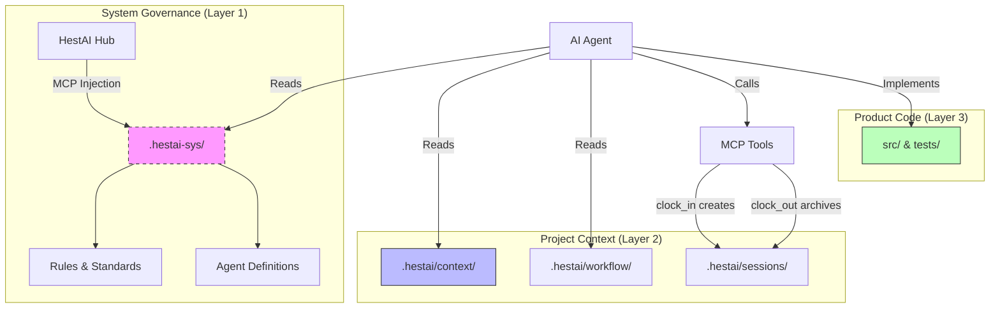

# HestAI-MCP Architecture

**Status**: IMPLEMENTATION PHASE
**Last Updated**: 2024-12-25
**Purpose**: Authoritative architecture definition for HestAI-MCP

---

## 1. System Overview

HestAI-MCP is a Model Context Protocol (MCP) server that provides **persistent memory, system governance, and context management** for AI agents. It solves the "Cognitive Continuity Crisis" by giving ephemeral AI sessions access to long-term project history and rules.

### Core Architecture: Dual-Layer Context

Defined in [ADR-0033](adr/adr-0033-dual-layer-context-architecture.md), the system separates concerns into two distinct layers with different delivery mechanisms:



| Layer | Content | Git Status | Who Writes |
|-------|---------|------------|------------|
| **System Governance** | Rules, agents, methodology in `.hestai-sys/` | Gitignored | MCP server (injected at runtime) |
| **Project Context** | Planning docs in `.hestai/context/`, `.hestai/workflow/` | Committed | MCP tools only (not agents directly) |
| **Sessions** | Active in `.hestai/sessions/active/`, Archive in `.hestai/sessions/archive/` | Active: gitignored, Archive: committed | `clock_in` and `clock_out` tools |

---

## 2. Key Components

### 2.1 The Orchestra Map (Dependency Awareness)

Defined in [ADR-0034](adr/adr-0034-orchestra-map-architecture.md).

Agents must understand the *impact* of their changes. We use **Anchor Pattern Inversion**:
*   Instead of Code citing Concepts (annotations that rot), **Concepts claim Code** (via imports in spec files).
*   Tools graph these imports to show which governance rules cover which code modules.

**Staleness Rule**: `LastCommit(Spec) < LastCommit(Impl) == STALE`

### 2.2 Living Artifacts (State Freshness)

Defined in [ADR-0035](adr/adr-0035-living-artifacts-auto-refresh.md).

Context must never be stale. We use a **Split-Artifact Hybrid** approach:
1.  **`docs/CHANGELOG.md`**: Updated by CI on every merge (audit trail).
2.  **`.hestai/context/*.oct.md`**: Generated freshly on every `clock_in` by querying git state + changelog + tests.
3.  **Local Warning**: Pre-commit hooks warn if context is >24h old.

### 2.3 Odyssean Anchor (Identity Binding)

Defined in [ADR-0036](adr/adr-0036-odyssean-anchor-binding.md).

Agents must bind to the project with verified identity.
*   **Unified Path**: Main agents and subagents use the exact same `/oa-load` ceremony.
*   **Structural Validation**: The `odyssean_anchor` MCP tool enforces a strict schema (RAPH Vector).
*   **Self-Correction**: Agents must retry if validation fails (Max 2 attempts).

---

## 3. Tool Ecosystem

All tools are owned by `hestai-mcp`. **Agents never write to `.hestai/` directly**—they call MCP tools which handle all file operations.

| Tool Category | Tools | Purpose |
|---------------|-------|---------|
| **Session** | `clock_in`, `clock_out` | Manage session lifecycle (see below) |
| **Binding** | `odyssean_anchor` | Validate agent identity and constraints |
| **Context** | `context_update`, `document_submit` | Single-writer access to `.hestai/` |
| **Analysis** | `codebase_investigator` | Deep dive into code structure |

### 3.1 Session Lifecycle

```
┌─────────────────────────────────────────────────────────────────┐
│  clock_in                                                       │
│  ├── Creates .hestai/sessions/active/{session_id}/session.json  │
│  ├── Returns paths to context files for agent to read           │
│  └── Detects focus conflicts with other active sessions         │
└─────────────────────────────────────────────────────────────────┘
                              ↓
                    Agent does work...
                              ↓
┌─────────────────────────────────────────────────────────────────┐
│  clock_out                                                      │
│  ├── Reads Claude's session JSONL from ~/.claude/projects/      │
│  ├── Redacts sensitive data (API keys, tokens)                  │
│  ├── Compresses to OCTAVE format (.oct.md)                      │
│  ├── Archives to .hestai/sessions/archive/                      │
│  └── Removes active session directory                           │
└─────────────────────────────────────────────────────────────────┘
```

**Key points:**
- Active sessions (`/active/`) are gitignored—ephemeral working state
- Archived sessions (`/archive/`) are committed—preserved knowledge
- Agents read context, tools write files

---

### 3.2 CI: Progressive Testing

HestAI-MCP CI uses a NOW/SOON/LATER progressive testing model (preflight routing, contract enforcement, artifact validation, conditional integration), plus a docs validation gate (OCTAVE protocol validation for changed `*.oct.md` and naming/visibility checks for changed docs).

See: `docs/workflow/ci-progressive-testing.oct.md:1`

---

## 4. Design Decisions (ADRs)

| ID | Title | Status |
|----|-------|--------|
| [ADR-0033](adr/adr-0033-dual-layer-context-architecture.md) | Dual-Layer Context Architecture | ✅ ACCEPTED |
| [ADR-0034](adr/adr-0034-orchestra-map-architecture.md) | Orchestra Map Architecture | ✅ VALIDATED |
| [ADR-0035](adr/adr-0035-living-artifacts-auto-refresh.md) | Living Artifacts Auto-Refresh | ✅ APPROVED |
| [ADR-0036](adr/adr-0036-odyssean-anchor-binding.md) | Odyssean Anchor Binding | ✅ ACCEPTED |

---

## 5. Directory Structure

```
your-project/
├── .hestai/                         # Project context (mostly committed)
│   ├── context/                     # Planning & state docs (committed)
│   │   ├── PROJECT-CONTEXT.oct.md   # Current project state
│   │   ├── PROJECT-ROADMAP.oct.md   # Phase planning
│   │   └── PROJECT-CHECKLIST.oct.md # Active tasks
│   ├── workflow/                    # Project-specific rules (committed)
│   │   └── 000-PROJECT-NORTH-STAR.oct.md
│   ├── sessions/
│   │   ├── active/                  # Current sessions (GITIGNORED)
│   │   └── archive/                 # Completed sessions (committed)
│   └── reports/                     # Generated reports (committed)
│
├── .hestai-sys/                     # System governance (GITIGNORED)
│                                    # Injected by MCP server at runtime
│
├── docs/
│   ├── adr/                         # Architecture Decision Records
│   └── CHANGELOG.md                 # CI-updated audit trail
│
└── src/                             # Application code
```

**What's committed vs gitignored:**
- ✅ Committed: `.hestai/context/`, `.hestai/workflow/`, `.hestai/sessions/archive/`, `.hestai/reports/`
- ❌ Gitignored: `.hestai/sessions/active/`, `.hestai-sys/`

---

**Philosophy**:
*   **Structural Integrity over Velocity**: It's better to block a session than allow it to run with broken context.
*   **Single Source of Truth**: Agents read from files, but write through tools.
*   **Visibility**: All agent-relevant context is in git (except system rules).
