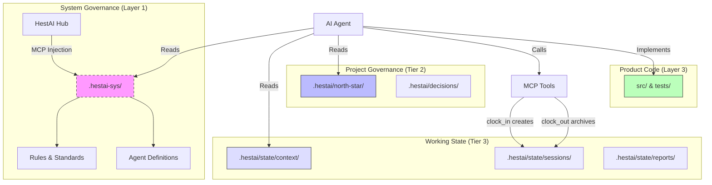

# HestAI-MCP Architecture

**Status**: IMPLEMENTATION PHASE
**Last Updated**: 2024-12-25
**Purpose**: Authoritative architecture definition for HestAI-MCP

---

## 1. System Overview

HestAI-MCP is a Model Context Protocol (MCP) server that provides **persistent memory, system governance, and context management** for AI agents. It solves the "Cognitive Continuity Crisis" by giving ephemeral AI sessions access to long-term project history and rules.

### Core Architecture: Dual-Layer Context

Defined in [ADR-0033](adr/adr-0033-dual-layer-context-architecture.md), the system separates concerns into two distinct layers with different delivery mechanisms:



| Layer | Content | Git Status | Who Writes |
|-------|---------|------------|------------|
| **Tier 1: System Governance** | Rules, agents, methodology in `.hestai-sys/` | Gitignored | MCP server (injected at runtime) |
| **Tier 2: Project Governance** | North Stars in `.hestai/north-star/`, decisions in `.hestai/decisions/` | Committed (PR-controlled) | Human via PR |
| **Tier 3: Working State** | Context, sessions, reports in `.hestai/state/` | Gitignored (shared via symlink) | MCP tools (clock_in, clock_out) |

---

## 2. Key Components

### 2.1 The Orchestra Map (Dependency Awareness)

Defined in [ADR-0034](adr/adr-0034-orchestra-map-architecture.md).

Agents must understand the *impact* of their changes. We use **Anchor Pattern Inversion**:
*   Instead of Code citing Concepts (annotations that rot), **Concepts claim Code** (via imports in spec files).
*   Tools graph these imports to show which governance rules cover which code modules.

**Staleness Rule**: `LastCommit(Spec) < LastCommit(Impl) == STALE`

### 2.2 Living Artifacts (State Freshness)

Defined in [ADR-0035](adr/adr-0035-living-artifacts-auto-refresh.md).

Context must never be stale. We use a **Split-Artifact Hybrid** approach:
1.  **`docs/CHANGELOG.md`**: Updated by CI on every merge (audit trail).
2.  **`.hestai/state/context/*.oct.md`**: Generated freshly on every `clock_in` by querying git state + changelog + tests.
3.  **Local Warning**: Pre-commit hooks warn if context is >24h old.

### 2.3 Odyssean Anchor (Identity Binding)

Defined in [ADR-0036](adr/adr-0036-odyssean-anchor-binding.md).

Agents must bind to the project with verified identity.
*   **Unified Path**: Main agents and subagents use the exact same `/bind` ceremony.
*   **Structural Validation**: The `odyssean_anchor` MCP tool enforces a strict schema (RAPH Vector).
*   **Self-Correction**: Agents must retry if validation fails (Max 2 attempts).

---

## 3. Tool Ecosystem

All tools are owned by `hestai-mcp`. **Agents never write to `.hestai/` directly**—they call MCP tools which route through the **System Steward** for validation and writing.

### 3.1 The System Steward Pattern

The System Steward is the **single writer** for all `.hestai/` content. When an agent calls any tool:

1. **Validates** the request against governance rules
2. **Routes** documents to correct locations (checking `visibility-rules.oct.md`)
3. **Writes** using `octave_create` or `octave_amend` (never raw file writes)

```
┌─────────────┐     ┌─────────────┐     ┌─────────────┐
│   Agent A   │     │   Agent B   │     │   Agent C   │
└──────┬──────┘     └──────┬──────┘     └──────┬──────┘
       │                   │                   │
       │ clock_in          │ document_submit   │ context_update
       │                   │                   │
       └───────────────────┼───────────────────┘
                           │
                           ▼
              ┌────────────────────────┐
              │    System Steward      │
              │                        │
              │  1. Validate request   │
              │  2. Check visibility-  │
              │     rules.oct.md       │
              │  3. Route to location  │
              │  4. octave_create or   │
              │     octave_amend       │
              └───────────┬────────────┘
                          │
                          ▼
              ┌────────────────────────┐
              │  .hestai/state/context/      │
              │  .hestai/north-star/     │
              │  .hestai/state/sessions/     │
              │  .hestai/state/reports/      │
              └────────────────────────┘
```

### 3.2 MCP Tools

| Tool | Agent Calls | System Steward Does |
|------|-------------|---------------------|
| `clock_in` | Request session start | Validate, create session.json, return context paths |
| `clock_out` | Request session end | Compress to OCTAVE, archive, **update `.hestai/state/context/` with learnings** |
| `document_submit` | Submit a document | Check `visibility-rules.oct.md`, route to path, write via `octave_create` |
| `context_update` | Request context change | Validate, write via `octave_create` or `octave_amend` |
| `odyssean_anchor` | Submit identity binding | Validate against schema, store anchor |

### 3.3 Session Lifecycle

```
┌─────────────────────────────────────────────────────────────────┐
│  clock_in (Agent calls → System Steward processes)              │
│  ├── Validates request                                          │
│  ├── Creates .hestai/state/sessions/active/{session_id}/session.json  │
│  ├── Returns paths to context files for agent to read           │
│  └── Detects focus conflicts with other active sessions         │
└─────────────────────────────────────────────────────────────────┘
                              ↓
                    Agent does work...
                              ↓
┌─────────────────────────────────────────────────────────────────┐
│  clock_out (Agent calls → System Steward processes)             │
│  ├── Reads Claude's session JSONL                               │
│  ├── Redacts sensitive data (API keys, tokens)                  │
│  ├── Compresses to OCTAVE format via octave_create              │
│  ├── Archives to .hestai/state/sessions/archive/                      │
│  ├── Updates .hestai/state/context/ with session learnings            │
│  └── Removes active session directory                           │
└─────────────────────────────────────────────────────────────────┘
```

**Key points:**
- System Steward is the gatekeeper—validates all requests
- All writes use `octave_create` or `octave_amend` (OCTAVE MCP tools)
- `clock_out` doesn't just archive—it updates project context with learnings

---

### 3.4 CI: Progressive Testing

HestAI-MCP CI uses a NOW/SOON/LATER progressive testing model (preflight routing, contract enforcement, artifact validation, conditional integration), plus a docs validation gate (OCTAVE protocol validation for changed `*.oct.md` and naming/visibility checks for changed docs).

See: `docs/workflow/ci-progressive-testing.oct.md:1`

---

## 4. Design Decisions (ADRs)

| ID | Title | Status |
|----|-------|--------|
| [ADR-0033](adr/adr-0033-dual-layer-context-architecture.md) | Dual-Layer Context Architecture | ✅ ACCEPTED |
| [ADR-0034](adr/adr-0034-orchestra-map-architecture.md) | Orchestra Map Architecture | ✅ VALIDATED |
| [ADR-0035](adr/adr-0035-living-artifacts-auto-refresh.md) | Living Artifacts Auto-Refresh | ✅ APPROVED |
| [ADR-0036](adr/adr-0036-odyssean-anchor-binding.md) | Odyssean Anchor Binding | ✅ ACCEPTED |

---

## 5. Hub Architecture (System Governance)

### Hub Content Flow

The hub content (system governance) is maintained in a single location and flows to consumer projects:

```
src/hestai_mcp/_bundled_hub/ (SINGLE SOURCE OF TRUTH - EDIT HERE)
  ↓
Python package build (includes _bundled_hub/**)
  ↓
pip install hestai-mcp
  ↓
MCP server starts (bootstrap_system_governance)
  ↓
.hestai-sys/ (read-only in consumer project)
```

### Critical Points

1. **`src/hestai_mcp/_bundled_hub/` is the single source of truth** - All governance edits go here
2. **No sync needed** - Single location eliminates drift and sync complexity
3. **Development in worktrees** - Changes are made in worktrees before merging to main
4. **`_bundled_hub/README.md` is agent-facing** - Documents the bundled hub structure

### What Goes in Hub?

Per `src/hestai_mcp/_bundled_hub/governance/rules/hub-authoring-rules.oct.md`:
- **System governance** - Rules that apply to ALL HestAI consumers
- **Agent constitutions** - Templates for agent roles
- **Reusable components** - Commands, skills, patterns
- **NOT project-specific content** - That goes in `.hestai/`

---

## 6. Directory Structure

```
your-project/
├── .hestai/                         # Project governance (Tier 2, committed)
│   ├── north-star/                  # Project North Star and components
│   │   └── 000-PROJECT-NORTH-STAR.oct.md
│   ├── decisions/                   # Architectural Decision Records
│   ├── rules/                       # Project-wide standards
│   └── state/ → .hestai-state/     # Working state (Tier 3, symlinked)
│       ├── context/                 # Planning & state docs
│       ├── sessions/
│       │   ├── active/             # Current sessions
│       │   └── archive/            # Completed sessions
│       ├── reports/                # Generated reports
│       └── research/               # Investigation findings
│
├── .hestai-sys/                     # System governance (Tier 1, GITIGNORED)
│                                    # Injected by MCP server at runtime
│
├── docs/
│   ├── adr/                         # Architecture Decision Records
│   └── CHANGELOG.md                 # CI-updated audit trail
│
└── src/                             # Application code
```

**Three-tier lifecycle:**
- **Tier 1** `.hestai-sys/`: Gitignored, MCP-delivered, read-only
- **Tier 2** `.hestai/`: Committed, PR-controlled (north-star, decisions, rules)
- **Tier 3** `.hestai/state/`: Gitignored, symlinked to shared `.hestai-state/`, writable by tools

---

**Philosophy**:
*   **Structural Integrity over Velocity**: It's better to block a session than allow it to run with broken context.
*   **Single Source of Truth**: Agents read from files, but write through tools.
*   **Visibility**: All agent-relevant context is in git (except system rules).
