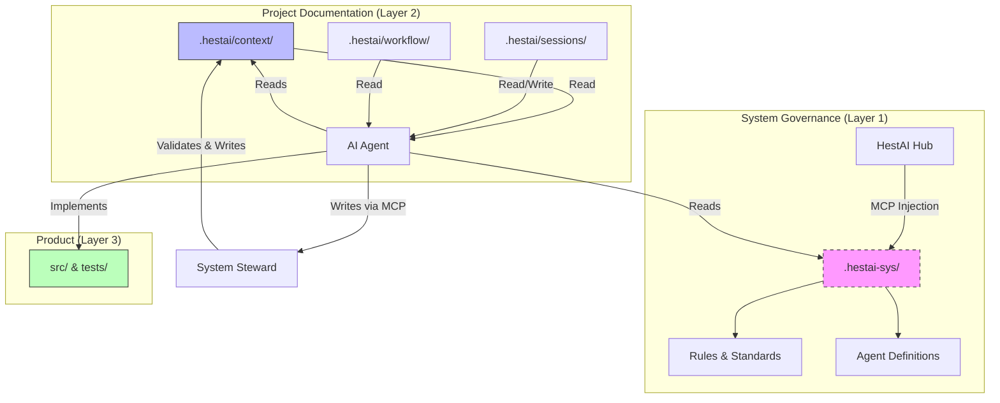

# HestAI-MCP Architecture

**Status**: IMPLEMENTATION PHASE
**Last Updated**: 2025-12-19
**Purpose**: Authoritative architecture definition for HestAI-MCP

---

## 1. System Overview

HestAI-MCP is a Model Context Protocol (MCP) server that provides **persistent memory, system governance, and context management** for AI agents. It solves the "Cognitive Continuity Crisis" by giving ephemeral AI sessions access to long-term project history and rules.

### Core Architecture: Dual-Layer Context

Defined in [ADR-0001](adr/adr-0001-dual-layer-context-architecture.md), the system separates concerns into two distinct layers with different delivery mechanisms:



| Layer | Content | Delivery | Git Status | Writer |
|-------|---------|----------|------------|--------|
| **System Governance** | Rules, agents, methodology | MCP server injection | `.gitignore` | HestAI system |
| **Project Documentation** | Context, sessions, reports | Direct files | Committed | System Steward only |

---

## 2. Key Components

### 2.1 The Orchestra Map (Dependency Awareness)

Defined in [ADR-0002](adr/adr-0002-orchestra-map-architecture.md).

Agents must understand the *impact* of their changes. We use **Anchor Pattern Inversion**:
*   Instead of Code citing Concepts (annotations that rot), **Concepts claim Code** (via imports in spec files).
*   Tools graph these imports to show which governance rules cover which code modules.

**Staleness Rule**: `LastCommit(Spec) < LastCommit(Impl) == STALE`

### 2.2 Living Artifacts (State Freshness)

Defined in [ADR-0003](adr/adr-0003-living-artifacts-auto-refresh.md).

Context must never be stale. We use a **Split-Artifact Hybrid** approach:
1.  **`docs/CHANGELOG.md`**: Updated by CI on every merge (audit trail).
2.  **`.hestai/context/*.oct.md`**: Generated freshly on every `clock_in` by querying git state + changelog + tests.
3.  **Local Warning**: Pre-commit hooks warn if context is >24h old.

### 2.3 Odyssean Anchor (Identity Binding)

Defined in [ADR-0004](adr/adr-0004-odyssean-anchor-binding.md).

Agents must bind to the project with verified identity.
*   **Unified Path**: Main agents and subagents use the exact same `/oa-load` ceremony.
*   **Structural Validation**: The `odyssean_anchor` MCP tool enforces a strict schema (RAPH Vector).
*   **Self-Correction**: Agents must retry if validation fails (Max 2 attempts).

---

## 3. Tool Ecosystem

All tools are owned by `hestai-mcp` (formerly split across repositories).

| Tool Category | Tools | Purpose |
|---------------|-------|---------|
| **Session** | `clock_in`, `clock_out` | Manage lifecycle, load/save context |
| **Binding** | `odyssean_anchor` | Validate agent identity and constraints |
| **Context** | `context_update`, `document_submit` | Single-writer access to `.hestai/` |
| **Analysis** | `codebase_investigator` | Deep dive into code structure |

---

## 4. Design Decisions (ADRs)

| ID | Title | Status |
|----|-------|--------|
| [ADR-0001](adr/adr-0001-dual-layer-context-architecture.md) | Dual-Layer Context Architecture | ✅ ACCEPTED |
| [ADR-0002](adr/adr-0002-orchestra-map-architecture.md) | Orchestra Map Architecture | ✅ VALIDATED |
| [ADR-0003](adr/adr-0003-living-artifacts-auto-refresh.md) | Living Artifacts Auto-Refresh | ✅ APPROVED |
| [ADR-0004](adr/adr-0004-odyssean-anchor-binding.md) | Odyssean Anchor Binding | ✅ ACCEPTED |

---

## 5. Directory Structure

```
your-project/
├── .hestai/                    # Project documentation (committed)
│   ├── context/                # Living operational state
│   ├── sessions/               # Session transcripts
│   └── workflow/               # Project-specific rules
├── .hestai-sys/                # System governance (gitignored, injected)
├── docs/
│   ├── adr/                    # Architecture Decision Records
│   └── CHANGELOG.md            # CI-updated audit trail
└── src/                        # Application code
```

---

**Philosophy**:
*   **Structural Integrity over Velocity**: It's better to block a session than allow it to run with broken context.
*   **Single Source of Truth**: Agents read from files, but write through tools.
*   **Visibility**: All agent-relevant context is in git (except system rules).
