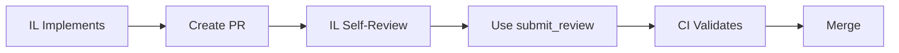
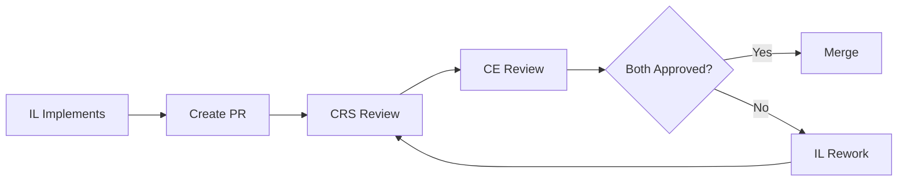

# submit_review Tool Workflow Guide

> **Note for Agents**: A compressed OCTAVE version of this guide is available at [submit-review-tool-workflow.oct.md](submit-review-tool-workflow.oct.md) for reduced token consumption (~70% compression).

## Overview
The `submit_review` tool is an MCP (Model Context Protocol) tool that enables agents to programmatically post PR review comments that clear the review-gate CI check. These comments are specially formatted to be recognized by the review-gate CI system, which automatically validates and processes them to clear review requirements.

## Current Capabilities

### What It Can Do
- Post review comments to existing PRs
- Format comments to match CI validation patterns
- Self-validate that APPROVED comments will clear gates
- Return structured errors with retry guidance
- Support dry-run mode for testing

### Current Limitation
**Requires an existing PR** - The tool posts to GitHub's issue comments API which needs a valid PR number.

## When to Use This Tool

Use the `submit_review` tool when:
- You've been asked to review a Pull Request
- You're completing implementation and need to self-review (IL role)
- You're a Code Review Specialist (CRS) reviewing code quality
- You're a Critical Engineer (CE) reviewing production readiness
- You need to block or conditionally approve changes

## Tool Parameters

The tool requires these parameters:
- `repo`: Repository in "owner/name" format (e.g., "elevanaltd/HestAI-MCP")
- `pr_number`: The PR number to comment on (must be an existing PR)
- `role`: Your reviewing role - one of "CRS", "CE", or "IL"
- `verdict`: Your decision - one of "APPROVED", "BLOCKED", or "CONDITIONAL"
- `assessment`: Your detailed review assessment (required, cannot be empty)
- `dry_run`: (optional) Set to `true` to test without posting (default: `false`)
- `model_annotation`: (optional) Add your model name for transparency (e.g., "Claude", "Gemini")

## Recommended Workflows

### 1. Simple Changes (Single Agent, Tier 1)


**Agent Instructions:**
```python
# After creating PR
result = await submit_review(
    repo="owner/repo",
    pr_number=123,
    role="IL",
    verdict="APPROVED",
    assessment="Tier 1 change: formatting only, no logic changes",
    dry_run=False
)
```

### 2. Standard Changes (Multi-Agent Review)


**HO Orchestration:**
```python
# Step 1: Delegate to IL
Task("implementation-lead", "Implement feature X with TDD")

# Step 2: After PR creation
Task("code-review-specialist", f"""
Review PR #{pr_number} using submit_review tool:
- Code quality and standards
- Test coverage
- Architecture alignment
""")

Task("critical-engineer", f"""
Review PR #{pr_number} using submit_review tool:
- Production readiness
- Performance implications
- Security concerns
""")
```

### 3. Complex Changes (Draft PR Strategy)


**Benefits of Draft PR:**
- Reviews can happen incrementally
- Feedback incorporated early
- Review comments accumulate in one place
- CI runs but doesn't block

**Commands:**
```bash
# Create draft PR
gh pr create --draft --title "WIP: Feature implementation"

# When ready
gh pr ready {pr_number}
```

## Review Tiers and Requirements

The system has three review tiers based on change complexity:

### Tier 1: Self-Review (IL Role)
- **When**: Changes under 50 lines, documentation/config only
- **Required**: IL APPROVED comment
- **Example changes**: README updates, config tweaks, small fixes

### Tier 2: Code Review (CRS Role)
- **When**: 50-500 lines of code changes
- **Required**: CRS APPROVED comment
- **Example changes**: Feature additions, bug fixes, refactoring

### Tier 3: Full Review (CRS + CE Roles)
- **When**: 500+ lines, architecture changes, database changes, cross-module changes
- **Required**: Both CRS APPROVED and CE APPROVED comments
- **Example changes**: Major features, system redesigns, security-critical code

## Tool Usage Examples

### Example Agent Usage

```python
# For an Implementation Lead self-review
await submit_review(
    repo="elevanaltd/HestAI-MCP",
    pr_number=123,
    role="IL",
    verdict="APPROVED",
    assessment="Self-review complete: All tests passing, TDD process followed, no logic changes",
    model_annotation="Claude"
)

# For a Code Review Specialist review
await submit_review(
    repo="elevanaltd/HestAI-MCP",
    pr_number=123,
    role="CRS",
    verdict="APPROVED",
    assessment="Code follows standards, good test coverage, clean architecture",
    model_annotation="Claude"
)

# For a Critical Engineer blocking a PR
await submit_review(
    repo="elevanaltd/HestAI-MCP",
    pr_number=123,
    role="CE",
    verdict="BLOCKED",
    assessment="Security vulnerability detected: SQL injection risk in user input handling at line 45",
    model_annotation="Claude"
)
```

### Dry Run (Testing Format)
```python
# Test without posting
result = await submit_review(
    repo="elevanaltd/HestAI-MCP",
    pr_number=123,
    role="CRS",
    verdict="APPROVED",
    assessment="Testing format",
    dry_run=True
)

# Check if format would clear gate
if result["validation"]["would_clear_crs"]:
    print("Format is correct")
```

### With Model Annotation
```python
# Adds model name to review
result = await submit_review(
    repo="elevanaltd/HestAI-MCP",
    pr_number=123,
    role="CE",
    verdict="APPROVED",
    assessment="No production risks identified",
    model_annotation="Gemini"  # Produces: "CE (Gemini) APPROVED: ..."
)
```

### Understanding the Response

The tool returns a structured response:

```json
{
  "success": true,
  "comment_url": "https://github.com/owner/repo/pull/123#issuecomment-456",
  "validation": {
    "would_clear_il": false,
    "would_clear_crs": true,
    "would_clear_ce": false
  },
  "tier_requirement": "TIER_2_CRS: CRS APPROVED comment required"
}
```

### Error Handling
```python
result = await submit_review(...)

if not result["success"]:
    error_type = result["error_type"]

    if error_type == "rate_limit":
        # Wait and retry with exponential backoff
        await asyncio.sleep(60)

    elif error_type == "auth":
        # Token issue - needs human intervention
        raise Exception("GitHub token missing or invalid")

    elif error_type == "network":
        # Transient failure - retry immediately
        result = await submit_review(...)

    elif error_type == "validation":
        # Bad input - do not retry
        print(f"Input error: {result['error']}")
```

## Future Enhancements

### 1. Commit Comments (Pre-PR)
Could extend to support commit-level reviews:
```python
# Hypothetical future feature
await submit_commit_review(
    repo="owner/repo",
    commit_sha="abc123",
    role="CRS",
    verdict="APPROVED",
    assessment="Commit looks good"
)
```

### 2. Batch Reviews
Could support reviewing multiple aspects at once:
```python
# Hypothetical future feature
await submit_review_batch(
    repo="owner/repo",
    pr_number=123,
    reviews=[
        {"role": "CRS", "verdict": "APPROVED", "assessment": "..."},
        {"role": "CE", "verdict": "CONDITIONAL", "assessment": "..."}
    ]
)
```

### 3. Review Templates
Could provide standard templates:
```python
# Hypothetical future feature
from hestai_mcp.modules.tools.review_templates import security_review

await submit_review(
    repo="owner/repo",
    pr_number=123,
    role="CE",
    template=security_review,
    findings={"sql_injection": False, "xss": False}
)
```

## Integration with CI

The review comments trigger the review-gate CI check which:

1. Scans PR comments for review patterns
2. Determines required approvals based on change tier
3. Validates format using shared `review_formats.py`
4. Updates PR status check

## Important Notes for Agents

1. **PR Must Exist**: You cannot use this tool to review commits that aren't in a PR yet. The PR must be created first.
2. **Format is Strict**: The tool validates your comment format before posting. Invalid formats are rejected to prevent posting comments that won't clear the CI gate.
3. **Only APPROVED Clears Gates**: BLOCKED and CONDITIONAL verdicts are valid reviews but won't clear the review gate. They're used to provide feedback that needs addressing.
4. **Be Specific in Assessments**: Especially for BLOCKED/CONDITIONAL verdicts, provide specific line numbers, file names, or detailed explanations of issues.
5. **Use Dry Run for Testing**: When unsure about format, use `dry_run=true` to validate without posting.

## Best Practices

1. **Use dry_run first** when testing format
2. **Be specific** in assessments, especially for BLOCKED/CONDITIONAL
3. **Include model annotation** for transparency
4. **Check error_type** to implement appropriate retry logic
5. **Create draft PRs** for complex changes needing iterative review

## Common Issues

### Review Not Recognized by CI
- Check exact format with dry_run
- Ensure no extra characters/formatting
- Verify role and verdict are valid

### Rate Limiting
- Implement exponential backoff
- Consider batching reviews
- Monitor x-ratelimit headers

### Authentication Errors
- Verify GITHUB_TOKEN is set
- Check token has repo scope
- Ensure token hasn't expired

## Common Mistakes to Avoid

1. **Don't forget the assessment**: Empty or whitespace-only assessments are rejected
2. **Don't use wrong role**: Ensure you're using the correct role for your agent type
3. **Don't assume verdicts clear gates**: Only APPROVED verdicts clear gates
4. **Don't post without a PR**: The PR must exist before you can review it
5. **Don't ignore validation errors**: If dry_run shows issues, fix them before posting
